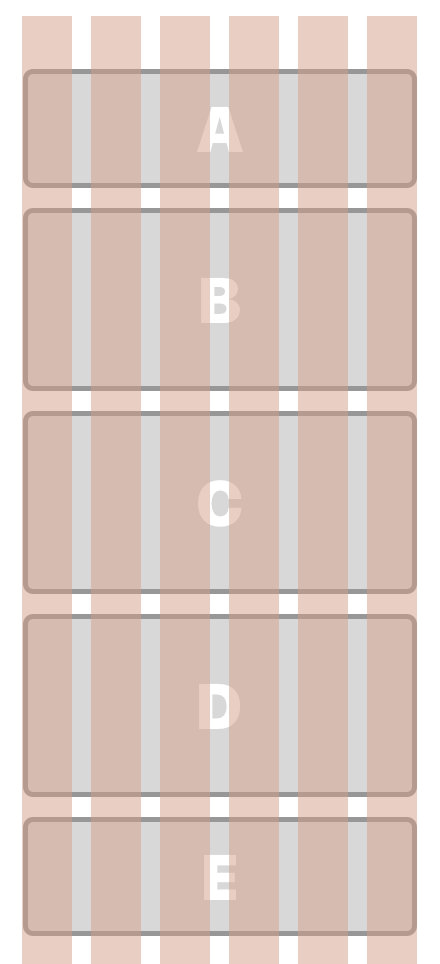

# Front-end-Web-Class-9

## Objectives

- Analyze pages for responsive design
- Apply media queries 

|   |   |   |   |
|---|---|---|---|
|   |   |   |   |

### 1 - @media

Use @media to define rules that apply only to specific media. 

#### What is "media" 

Media can be just about anything. CSS defines the following media types: 

- all
- print
- screen
- speech

But that's not all these can be qualified by checking the features of the current media. 
CSS looks at the following features see the list here: 

[https://developer.mozilla.org/en-US/docs/Web/CSS/@media](https://developer.mozilla.org/en-US/docs/Web/CSS/@media)

There are also some modifiers that can applied: and, only, max, min. 

You can put these together to create CSS rules that apply in a wide variety of situations. 
Generally the most common use is creating rules that apply to mobile vs desktop. 
These are usually written to target different screen sizes. 

#### Break points 

The term "break point" describes the width at which we can assume fits the screen size of a range of devices. 
For example, if a device has a maximum width of 320px then it must be one of the early iPhones or a very smaller computer.
If the minimum width is 768px it's at least an iPad in portrait, though it could be a larger device. 

### 3 - Responsive stratgeies 

In general terms you will want to design for one platform mobile or desktop. 
Then use media queries to target rules for the other platform. 

For example, imagine you have designed your web site for the desktop. 
You have a box that is 33% width. On mobile this would be too narrow, 
you decide that on molbile boxes should be 100%. 
In CSS this might look this:

```
.box {
    width: 33%;
}

@media screen and (max-width: 414px) { 
    .box {
        width: 100%;
    }
}
```

The first rule sets the width of .box to 33%. 
The @media block contains a block of CSS that defines the width of .box to 100%.
Notice that following @media we have said that the media type is screen and
features a maximum width of 414px. 

The rules defined inside @media are only applied when the conditions are met.

Here it is in picture form:

__Desktop__


__Mobile__



#### Points vs Pixels 

Cell phones screens are made up of pixels the software that runs the display 
calculate screen coordinates in points. Points are abstract units that relate 
screens of different pixel densities. 

For example, the iPhone 6 is 375 points wide, the screen is 750 pixels wide. 
You should always think in point sizes.

For more info on points and pixels see this guide:

- https://www.paintcodeapp.com/news/ultimate-guide-to-iphone-resolutions

### Common break points

If you are starting out you can use the Boostrap CSS media queries as a starting point. 

[bootstrap-media-queries.css](bootstrap-media-queries.css)

This contains two sets of media queries one set marked "Mobile First". 
The other marked "Desktop First". Mobile first assumes that all of the styles 
__outside__ of the media queries style the mobile version, while all of the 
styles in the media queries define style changes that make your site work 
on other screen sizes, like desktop, or tablets. The desktop first rules 
assume you styled the desktop first and will use the media queries to adjust 
styles for mobile devices. 

## Resources 

- https://www.fastcodesign.com/3038367/9-gifs-that-explain-responsive-design-brilliantly
- http://1stwebdesigner.com/responsive-design-breakpoints/
- https://css-tricks.com/snippets/css/media-queries-for-standard-devices/
- https://developers.google.com/web/fundamentals/design-and-ui/responsive/


### Closer look at jQuery

Adding and removing classes from an element or group of elements 
probably has the most practical applications with jQuery.


Slide shows 

- Horizontal 
- Vertical 
- Two axis
- Opposing motion
- Put a slide show in a window
- use the whole page
